# Sprint 002

## Task: Chat session controls, token usage status, and tool call log
- **Status:** Finished
- **Scope:** Add chat memory controls for continuing or restarting sessions, show running token usage totals in the chat panel, and log tool calls without per-tool token counts.
- **Modified production files:**
  - freeplane_plugin_ai/src/main/java/org/freeplane/plugin/ai/chat/AIChatPanel.java
  - freeplane_plugin_ai/src/main/java/org/freeplane/plugin/ai/chat/AIChatService.java
  - freeplane_plugin_ai/src/main/java/org/freeplane/plugin/ai/chat/AIChatServiceFactory.java
  - freeplane_plugin_ai/src/main/java/org/freeplane/plugin/ai/chat/ChatMemoryMode.java
  - freeplane_plugin_ai/src/main/java/org/freeplane/plugin/ai/chat/ChatMemorySettings.java
  - freeplane_plugin_ai/src/main/java/org/freeplane/plugin/ai/chat/ChatSessionMemoryController.java
  - freeplane_plugin_ai/src/main/java/org/freeplane/plugin/ai/chat/ChatTokenUsageTracker.java
  - freeplane_plugin_ai/src/main/java/org/freeplane/plugin/ai/chat/ChatUsageTotals.java
- **Modified test files:**
  - freeplane_plugin_ai/src/test/java/org/freeplane/plugin/ai/chat/ChatSessionMemoryControllerTest.java
  - freeplane_plugin_ai/src/test/java/org/freeplane/plugin/ai/chat/ChatTokenUsageTrackerTest.java
- **Research summary:**
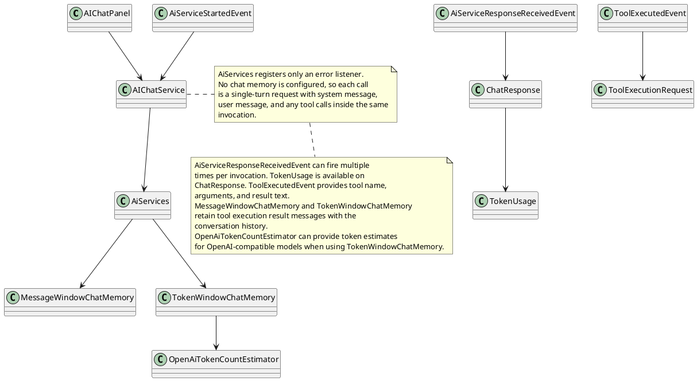
- **Design:**
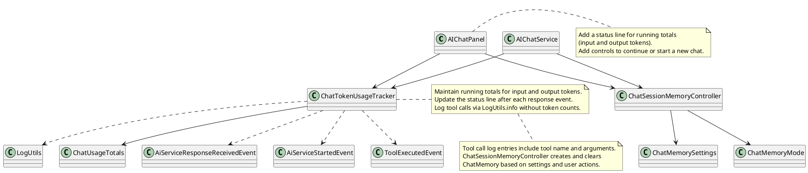
- **Test specification:**
  - Verify chat memory is reused when continuing a session.
  - Verify chat memory is cleared when starting a new session.
  - Verify usage totals update after response events.
  - Verify a tool call event writes to LogUtils.
  - Verify the status line reflects cumulative totals.

## Task: Review llm feedback for read tools
- **Status:** Finished
- **Scope:** Apply feedback to the read tool by renaming it to readNodeWithContext, flattening parameters, adding section selectors, and omitting null fields in responses.
- **Modified production files:**
  - freeplane_plugin_ai/src/main/java/org/freeplane/plugin/ai/tools/AIToolSet.java
  - freeplane_plugin_ai/src/main/java/org/freeplane/plugin/ai/tools/ContextSection.java
  - freeplane_plugin_ai/src/main/java/org/freeplane/plugin/ai/tools/NodeContent.java
  - freeplane_plugin_ai/src/main/java/org/freeplane/plugin/ai/tools/NodeContentItem.java
  - freeplane_plugin_ai/src/main/java/org/freeplane/plugin/ai/tools/NodeContentItemReader.java
  - freeplane_plugin_ai/src/main/java/org/freeplane/plugin/ai/tools/ReadNodeWithContextResponse.java
  - freeplane_plugin_ai/src/main/java/org/freeplane/plugin/ai/tools/ReadNodeWithContextTool.java
  - freeplane_plugin_ai/src/main/java/org/freeplane/plugin/ai/tools/TextualContent.java
  - freeplane_plugin_ai/src/main/java/org/freeplane/plugin/ai/tools/AttributesContent.java
  - freeplane_plugin_ai/src/main/java/org/freeplane/plugin/ai/tools/TagsContent.java
- **Modified test files:**
  - freeplane_plugin_ai/src/test/java/org/freeplane/plugin/ai/tools/ReadNodeWithContextToolTest.java
- **Research summary:**
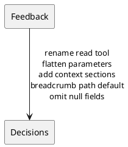
- **Design:**
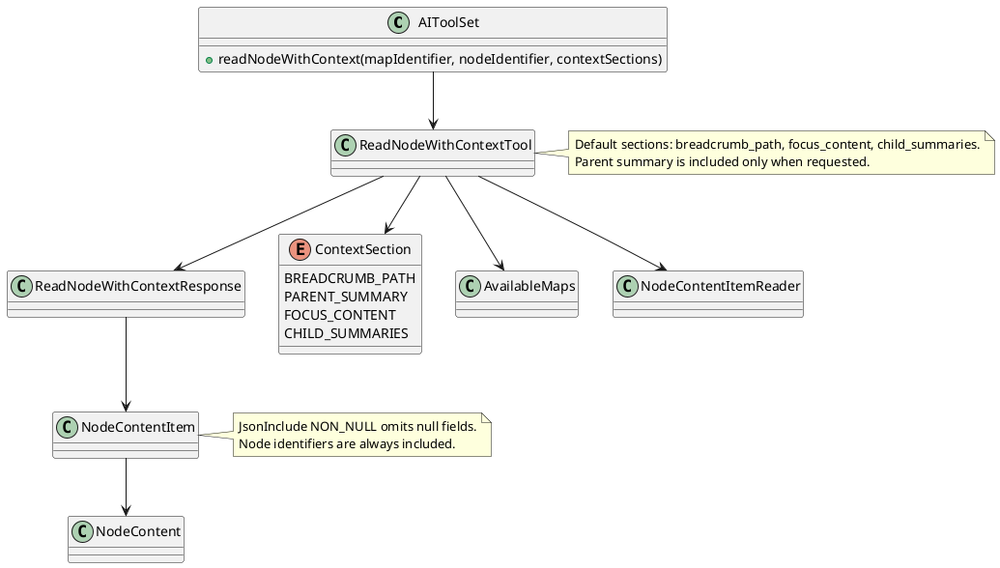
- **Test specification:**
  - Verify default sections include focus content, child summaries, and breadcrumb path.
  - Verify parent summary is included when requested.
  - Verify focus content is omitted when not requested.
  - Verify invalid map identifiers fail fast.

## Task: Add icon content to node responses
- **Status:** Designing
- **Scope:** Expose node icons in read responses with icon names and optional emoji decoding for emoji icons.
- **Research summary:**
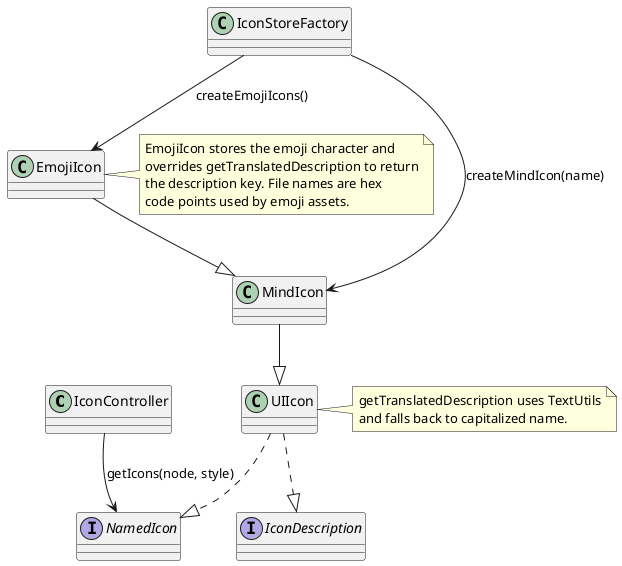

## Task: Add selection identifiers tool
- **Status:** Finished
- **Scope:** Add a tool that returns the currently selected map identifier, selected node identifier, and root node identifier.
- **Modified production files:**
  - freeplane_plugin_ai/src/main/java/org/freeplane/plugin/ai/tools/AIToolSet.java
  - freeplane_plugin_ai/src/main/java/org/freeplane/plugin/ai/tools/SelectedMapAndNodeIdentifiersTool.java
  - freeplane_plugin_ai/src/main/java/org/freeplane/plugin/ai/tools/SelectionIdentifiersResponse.java
- **Research summary:**
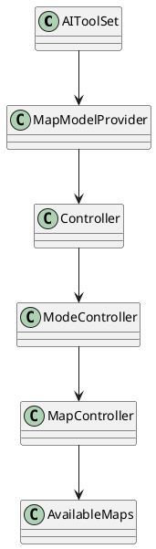
- **Design:**
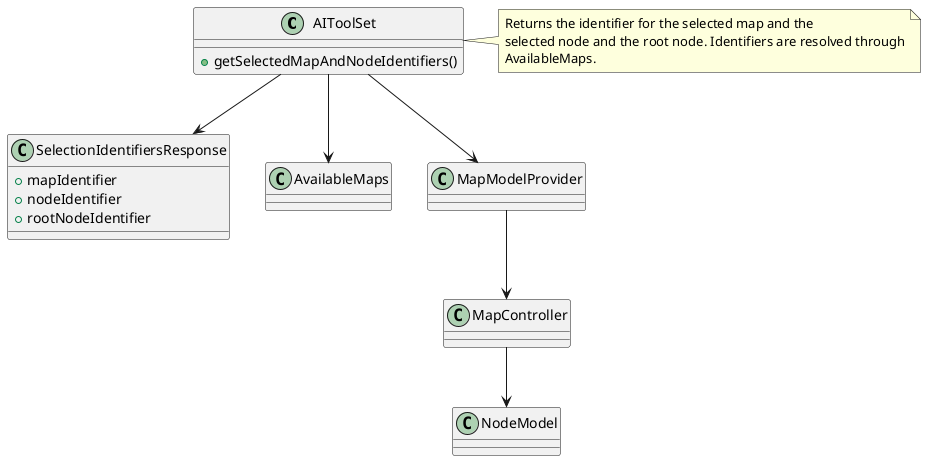
- **Test specification:**
  - Verify the tool returns identifiers for the current map, selected node, and root node.
- **Design:**
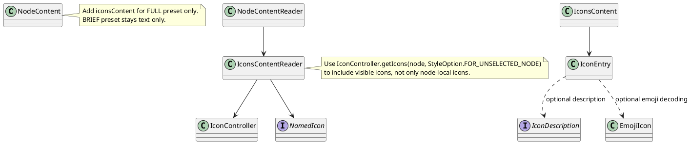
- **Test specification:**
  - Verify icon entries include name and file for each icon.
  - Verify emoji icons include an emoji value when decoding is enabled.
  - Verify no icons content is returned for BRIEF preset.

## Task: Model Context Protocol server
- **Status:** Finished
- **Scope:** Expose existing read tools through a Model Context Protocol server over an HTTP endpoint bound to the local interface, with startup controlled by preferences.
- **Modified production files:**
  - freeplane_plugin_ai/src/main/java/org/freeplane/plugin/ai/Activator.java
  - freeplane_plugin_ai/src/main/java/org/freeplane/plugin/ai/mcpserver/ModelContextProtocolServer.java
  - freeplane_plugin_ai/src/main/java/org/freeplane/plugin/ai/mcpserver/ModelContextProtocolTool.java
  - freeplane_plugin_ai/src/main/java/org/freeplane/plugin/ai/mcpserver/ModelContextProtocolToolDispatcher.java
  - freeplane_plugin_ai/src/main/java/org/freeplane/plugin/ai/mcpserver/ModelContextProtocolToolRegistry.java
  - freeplane_plugin_ai/src/main/resources/org/freeplane/plugin/ai/defaults.properties
  - freeplane_plugin_ai/src/main/resources/org/freeplane/plugin/ai/preferences.xml
- **Research summary:**
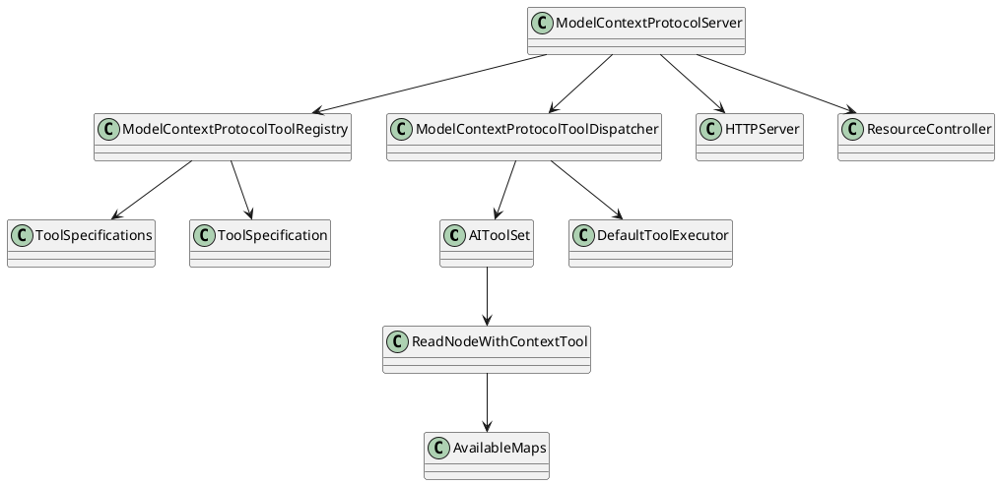
- **Design:**
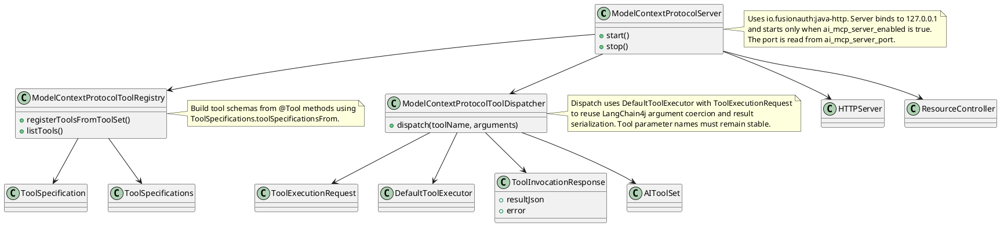
- **Test specification:**
  - Verify tool registry returns schemas for read tools.
  - Verify dispatch routes a tool call to AIToolSet and returns JSON output.
  - Verify invalid tool name returns a protocol error response.

## Task: Extend readNodeWithContext content selection and optional qualifiers
- **Status:** Finished
- **Scope:** Redesign the read tool to accept list-only node identifiers and return list-only responses in the same order, add depth control for full content and summaries, enforce a total text budget by omitting nodes instead of truncating values, and make qualifiers optional.
- **Research summary:**
  - AI map exploration benefits from list-only requests to reduce round trips.
  - Total text budget control is more reliable than per node limits for tool safety.
  - Omitting nodes preserves full values while keeping responses within budget.
  - Separate depths for full content and brief summaries balance detail and coverage.
- **Design:**
  - List-only request and response ordered by nodeIdentifiers.
  - Depth controls: fullContentDepth plus additional summaryDepth.
  - NodeContentRequest overrides for focus, parent, and child nodes with presets as fallback.
  - Exact JavaScript Object Notation length budget with omissions instead of truncation.
  - Response-level omissions for omitted focus nodes, per-item childOmissions for omitted children and descendants.
  - Optional qualifiers enabled only via contextSections.
  - Tool schema marks optional fields explicitly and documents non-trivial defaults in field descriptions.
- **Design diagram:**
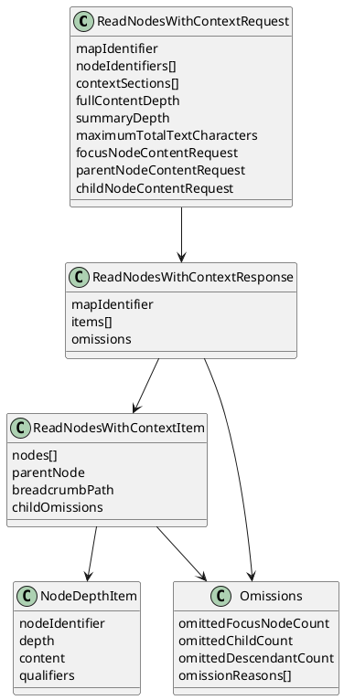
- **Request parameters:**
  - `mapIdentifier`: Map identifier string.
  - `nodeIdentifiers`: List of node identifier strings. Order is preserved in the response.
  - `contextSections`: List of ContextSection values. Default: `BREADCRUMB_PATH`. Supported values: `BREADCRUMB_PATH`, `PARENT_SUMMARY`, `QUALIFIERS`.
  - `fullContentDepth`: Integer greater than or equal to 0. Default 0. Depth 0 is the requested node.
  - `summaryDepth`: Integer greater than or equal to 0. Default 1. This is the number of additional levels beyond fullContentDepth that return brief summaries. For example fullContentDepth 1 and summaryDepth 1 yields full content at depths 0–1 and brief summaries at depth 2.
  - `maximumTotalTextCharacters`: Integer. Default 65536.
  - `focusNodeContentRequest`: NodeContentRequest. Optional override for focus node full content.
  - `parentNodeContentRequest`: NodeContentRequest. Optional override for parent node summary content.
  - `childNodeContentRequest`: NodeContentRequest. Optional override for descendant full content.
- **Response fields:**
  - `mapIdentifier`: Map identifier string.
  - `items`: List of ReadNodesWithContextItem entries in the same order as nodeIdentifiers, excluding any omitted focus nodes.
  - `omissions`: Object, only when focus nodes are omitted.
- **ReadNodesWithContextItem:**
  - `nodes`: List of NodeDepthItem entries in preorder from depth 0 through depth fullContentDepth plus summaryDepth. Depth 0 is the requested node.
  - `parentNode`: NodeContentItem, only when `PARENT_SUMMARY` is present in contextSections.
  - `breadcrumbPath`: String, only when `BREADCRUMB_PATH` is present in contextSections.
  - `childOmissions`: Object, only when child or descendant omissions occur.
- **NodeDepthItem:**
  - `nodeIdentifier`: Node identifier string.
  - `depth`: Integer depth relative to the requested node.
  - `content`: NodeContent. Included for all nodes; summary nodes include briefText only.
  - `qualifiers`: List of strings, only when `QUALIFIERS` is present in contextSections.
- **Omissions:**
  - `omittedFocusNodeCount`: Integer (response-level omissions only).
  - `omittedChildCount`: Integer (childOmissions only).
  - `omittedDescendantCount`: Integer (childOmissions only).
  - `omissionReasons`: List of OmissionReason values.
- **Behavior:**
  - Summary depth always extends beyond fullContentDepth. Brief summaries cover depth fullContentDepth plus 1 through fullContentDepth plus summaryDepth.
  - Summary nodes always return briefText only. NodeContentRequest is ignored for summary nodes.
  - NodeContentRequest overrides are applied only to full content nodes. If a NodeContentRequest is not provided, presets are used: full for focus and child nodes, brief for parent node.
  - Qualifiers are computed and returned only when `QUALIFIERS` is present in contextSections.
  - Textual content values are returned as plain text using HtmlUtils.htmlToPlain, with markup removed when present.
  - The total text budget uses exact JavaScript Object Notation serialization length and is enforced only when more than one focus node is requested.
  - When the budget is exceeded, the tool omits nodes instead of truncating values. Omitted focus nodes are excluded from `items` and counted in response-level omissions with omissionReasons containing `TEXT_BUDGET`. Omitted child and descendant nodes are recorded in childOmissions.
  - Single focus node requests are never truncated, regardless of maximumTotalTextCharacters.
  - Duplicate node identifiers return an error with message "duplicate node identifiers".
  - Unknown node identifiers return an error with message "Unknown node identifiers: ..." and the list of unknown identifiers.
  - When nodeIdentifiers is empty or null, the tool uses the root node identifier as the only requested node.
- **Test specification:**
  - Verify response preserves requested node order.
  - Verify fullContentDepth and summaryDepth produce expected depth ranges.
  - Verify summary nodes include only briefText and ignore NodeContentRequest.
  - Verify qualifiers are omitted unless requested.
  - Verify total text budget omits nodes for multi node requests and never truncates single node requests.
  - Verify omissions include omissionReasons with `TEXT_BUDGET` when budget is exceeded.

## Task: Search nodes using NodeContentRequest scope
- **Status:** Finished
- **Scope:** Add a search tool that accepts subtree roots and pagination, scopes search using NodeContentRequest, and enforces a total text budget by omitting results instead of truncating values.
- **Research summary:**
  - Search should be independent from map filter state to avoid hidden scope changes.
  - Subtree roots allow targeted search without additional filter tools.
  - Pagination controls reduce payload size and support incremental browsing.
  - Omitting results under a total text budget keeps response values intact.
- **Design:**
  - Query plus subtreeRootNodeIdentifiers define search scope.
  - Offset and limit control pagination.
  - NodeContentRequest selects which fields are searched.
  - Exact JavaScript Object Notation length budget with omissions instead of truncation.
  - Case sensitivity controls apply to all matching modes.
  - Tool schema marks optional fields explicitly and documents non-trivial defaults in field descriptions.
- **Design diagram:**
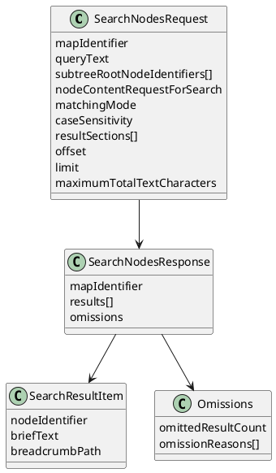
- **Request parameters:**
  - `mapIdentifier`: Map identifier string.
  - `queryText`: Search query string.
  - `subtreeRootNodeIdentifiers`: List of node identifier strings that restrict search to those subtrees. When empty or null, search the whole map.
  - `nodeContentRequestForSearch`: NodeContentRequest that selects which content fields are searched.
  - `matchingMode`: SearchMatchingMode. Default `CONTAINS`.
  - `caseSensitivity`: SearchCaseSensitivity. Default `CASE_INSENSITIVE`.
  - `resultSections`: List of values. Supported values: `BREADCRUMB_PATH`.
  - `offset`: Integer. Default 0.
  - `limit`: Integer. Default 200.
  - `maximumTotalTextCharacters`: Integer. Default 65536.
- **Response fields:**
  - `mapIdentifier`: Map identifier string.
  - `results`: List of SearchResultItem entries.
  - `omissions`: Object, only when omissions occur.
- **SearchResultItem:**
  - `nodeIdentifier`: Node identifier string.
  - `briefText`: String.
  - `breadcrumbPath`: String, only when `BREADCRUMB_PATH` is present in resultSections.
- **Omissions:**
  - `omittedResultCount`: Integer.
  - `omissionReasons`: List of OmissionReason values.
- **Behavior:**
  - Results are ordered by map traversal order within each subtree root, and then filtered by offset and limit.
  - The total text budget uses exact JavaScript Object Notation serialization length and omits results rather than truncating values, with omissionReasons containing `TEXT_BUDGET`.
  - Search matching is controlled by matchingMode and caseSensitivity. CONTAINS uses substring matching, EQUALS uses full value matching, and REGULAR_EXPRESSION uses Java regular expression matching on the selected fields. CASE_INSENSITIVE applies to all modes.
  - Duplicate subtree root node identifiers return an error with message "duplicate subtree root node identifiers".
  - Unknown subtree root node identifiers return an error with message "Unknown node identifiers: ..." and the list of unknown identifiers.
  - Search remains independent from filter state.
- **Test specification:**
  - Verify subtreeRootNodeIdentifiers limits search scope.
  - Verify offset and limit paginate results.
  - Verify NodeContentRequest controls which fields are searched.
  - Verify breadcrumbPath is included only when requested.
  - Verify caseSensitivity applies to contains, equals, and regular expression matching.
  - Verify total text budget omits results and sets omissionReasons to `TEXT_BUDGET`.

## Task: Add editable content for safe edits
- **Status:** Designing
- **Scope:** Add an optional editable content block that exposes raw values and format metadata for text, details, note, and attributes so a large language model can edit safely without losing formulas or markup.
- **Research summary:**
  - TextController applies a transformer chain that can change display text, add formatting, or evaluate formulas.
  - RichTextModel stores content type and raw or Extensible Markup Language content separately from transformed output.
  - Attributes are transformed for display, but their raw values should be preserved for editing.
- **Design:**
  - Add EditableContentRequest to NodeContentRequest to opt in to editable content.
  - EditableContentRequest selects fields (TEXT, DETAILS, NOTE, ATTRIBUTES) and representations (RAW, TRANSFORMED, PLAIN, METADATA).
  - EditableContent appears only when requested to reduce token usage.
  - Each editable field includes raw content, transformed content, plain text, and metadata for format and formula detection.
- **Design diagram:**
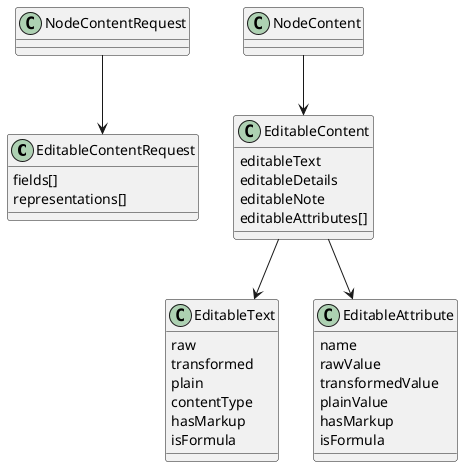
- **Test specification:**
  - Verify editable content is omitted when not requested.
  - Verify raw values match stored values for text, details, note, and attributes.
  - Verify transformed values match TextController output.
  - Verify plain values use HtmlUtils.htmlToPlain and do not include markup.
  - Verify formula detection sets isFormula for formula content and leaves it false for normal text.

## Shared structures for read and search tools
- **NodeContentRequest:**
  - `textualContentRequest`: TextualContentRequest. Optional; omit to skip textual content matching or inclusion.
  - `attributesContentRequest`: AttributesContentRequest. Optional; omit to skip attributes matching or inclusion.
  - `tagsContentRequest`: TagsContentRequest. Optional; omit to skip tags matching or inclusion.
- **TextualContentRequest:**
  - `includesText`: Boolean.
  - `includesDetails`: Boolean.
  - `includesNote`: Boolean.
- **AttributesContentRequest:**
  - `includesAttributes`: Boolean.
- **TagsContentRequest:**
  - `includesTags`: Boolean.
- **NodeContentItem:**
  - `nodeIdentifier`: Node identifier string.
  - `content`: NodeContent.
  - `qualifiers`: List of strings when qualifiers are requested.
- **NodeContent:**
  - `briefText`: String.
  - `textualContent`: TextualContent.
  - `attributesContent`: AttributesContent.
  - `tagsContent`: TagsContent.
- **OmissionReason:**
  - `TEXT_BUDGET`: Omitted because the maximumTotalTextCharacters budget was exceeded.
- **SearchMatchingMode:**
  - `CONTAINS`: Substring match (caseSensitivity controls casing).
  - `EQUALS`: Full value match (caseSensitivity controls casing).
  - `REGULAR_EXPRESSION`: Java regular expression match (caseSensitivity controls casing).
- **SearchCaseSensitivity:**
  - `CASE_INSENSITIVE`: Case-insensitive matching for all modes.
  - `CASE_SENSITIVE`: Case-sensitive matching for all modes.
