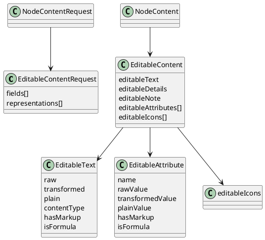

# Task: Add editable content for safe edits
- **Scope:** Add an optional editable content block that exposes raw values and format metadata for text, details, note, attributes, and explicit node icons so a large language model can edit safely without losing formulas or markup.
- **Research summary:**
  - TextController applies a transformer chain that can change display text, add formatting, or evaluate formulas.
  - RichTextModel stores content type and raw or Extensible Markup Language content separately from transformed output.
  - Attributes are transformed for display, but their raw values should be preserved for editing.
  - Explicit node icons are stored on the node (`NodeModel.getIcons()`), which excludes style icons. This is the icon set that should be editable.
- **Design:**
  - Add EditableContentRequest to NodeContentRequest to opt in to editable content.
  - EditableContentRequest selects fields (TEXT, DETAILS, NOTE, ATTRIBUTES) and representations (RAW, TRANSFORMED, PLAIN, METADATA).
  - EditableContent appears only when requested to reduce token usage.
  - Each editable field includes raw content, transformed content, plain text, and metadata for format and formula detection.
  - Add editableIcons to EditableContent, sourced only from `NodeModel.getIcons()` and described with the same English description rules used elsewhere (Resources_en.properties, emoji decoding, user icon relative path).
- **Design diagram:**

- **Test specification:**
  - Verify editable content is omitted when not requested.
  - Verify raw values match stored values for text, details, note, and attributes.
  - Verify transformed values match TextController output.
  - Verify plain values use HtmlUtils.htmlToPlain and do not include markup.
  - Verify formula detection sets isFormula for formula content and leaves it false for normal text.
  - Verify editable icons only include explicit node icons and exclude style icons.
