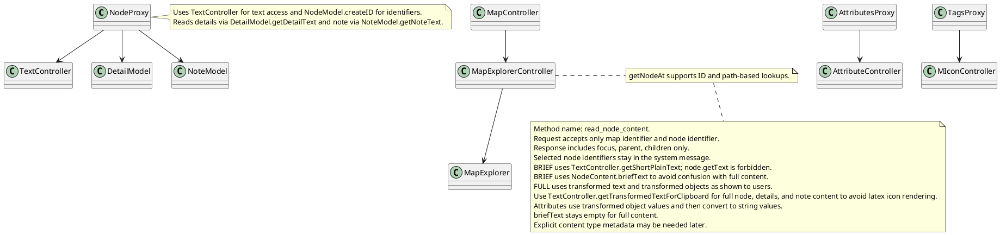
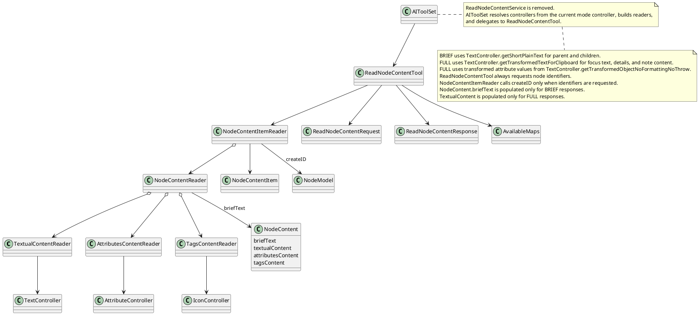
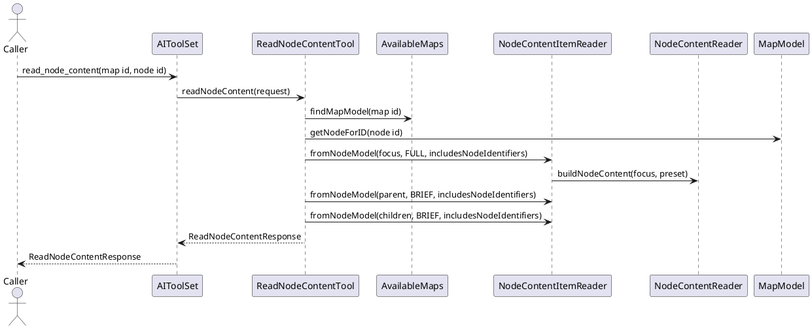

# Task: Implement reading methods
- **Scope:** Implement read_node_content with a request that requires only map identifier and node identifier, always include node identifiers in the response, and return focus, parent, and child nodes with preset content; update AIToolSet to use the new method and remove the old read context request and response types.
- **Modified production files:**
  - freeplane_plugin_ai/src/main/java/org/freeplane/plugin/ai/tools/AIToolSet.java
  - freeplane_plugin_ai/src/main/java/org/freeplane/plugin/ai/tools/AttributesContentReader.java
  - freeplane_plugin_ai/src/main/java/org/freeplane/plugin/ai/tools/NodeContent.java
  - freeplane_plugin_ai/src/main/java/org/freeplane/plugin/ai/tools/NodeContentItem.java
  - freeplane_plugin_ai/src/main/java/org/freeplane/plugin/ai/tools/NodeContentItemReader.java
  - freeplane_plugin_ai/src/main/java/org/freeplane/plugin/ai/tools/NodeContentReader.java
  - freeplane_plugin_ai/src/main/java/org/freeplane/plugin/ai/tools/ReadNodeContentTool.java
  - freeplane_plugin_ai/src/main/java/org/freeplane/plugin/ai/tools/ReadNodeContentRequest.java
  - freeplane_plugin_ai/src/main/java/org/freeplane/plugin/ai/tools/ReadNodeContentResponse.java
  - freeplane_plugin_ai/src/main/java/org/freeplane/plugin/ai/tools/TagsContentReader.java
  - freeplane_plugin_ai/src/main/java/org/freeplane/plugin/ai/tools/TextualContentReader.java
- **Modified test files:**
  - freeplane_plugin_ai/src/test/java/org/freeplane/plugin/ai/tools/NodeContentReaderTest.java
  - freeplane_plugin_ai/src/test/java/org/freeplane/plugin/ai/tools/ReadNodeContentToolTest.java
  - freeplane_plugin_ai/src/test/java/org/freeplane/plugin/ai/tools/TextualContentReaderTest.java
- **Research summary:**

- **Design:**

- **Test specification:**
  - Verify BRIEF response includes focus, parent, and children with briefText and node identifiers.
  - Verify missing parent returns null and empty children list.
  - Verify invalid map identifier throws a validation error.
- Verify TextController.getShortPlainText is used for BRIEF content.
- Verify TextualContent is null for BRIEF responses.
- Verify TextController.getShortPlainText is used for BRIEF content.
- Add tests for FULL focus content, including text, details, note, attributes, and tags.
- Add a test that full text uses TextController.getTransformedTextForClipboard.
