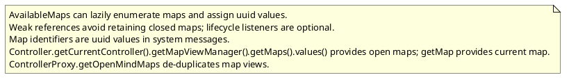
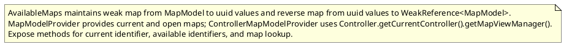

# Task: AvailableMaps registry for map identifiers
- **Scope:** Introduce AvailableMaps to provide session map identifiers backed by weak references and allow lookup by identifier.
- **Modified production files:**
  - freeplane_plugin_ai/src/main/java/org/freeplane/plugin/ai/maps/AvailableMaps.java
  - freeplane_plugin_ai/src/main/java/org/freeplane/plugin/ai/maps/ControllerMapModelProvider.java
  - freeplane_plugin_ai/src/main/java/org/freeplane/plugin/ai/maps/MapModelProvider.java
- **Modified test files:**
  - freeplane_plugin_ai/src/test/java/org/freeplane/plugin/ai/maps/AvailableMapsTest.java
- **Research summary:**

- **Design:**

- **Test specification:**
  - Verify uuid stability for a map model.
  - Verify identifier list for open maps.
  - Verify lookup from identifier to map model.
