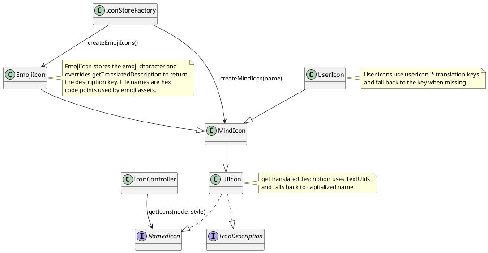

# Task: Add icon content to node responses
- **Scope:** Expose node icons in read responses as human-friendly descriptions only, aligned with localized icon translations and emoji characters, while keeping an internal mapping to icon identifiers for future edit tools.
- **Research summary:**
  - `TextUtils.getText` uses the current UI language. `TextUtils.getOriginalRawText` reads the default `Resources_en.properties` entry and bypasses the UI language.
  - `IconRegistry` tracks icons that are used on a map during the session (used by icon filtering UI). It is not a full icon catalog and may include state icons from providers that opt into registry inclusion.

- **Design:**
  - Add `iconsContent` to NodeContent with a single field `descriptions`, a list of human-friendly strings in the icon order returned by `IconController.getIcons(node, StyleOption.FOR_UNSELECTED_NODE)`.
  - Use English descriptions derived from `TextUtils.getOriginalRawText` for built-in icons (no mnemonic stripping) and update `Resources_en.properties` `icon_*` entries when descriptions do not match the icon meaning.
  - Document that icon descriptions are always English; any icon search should match English descriptions by default, with optional inclusion of current UI language descriptions if needed later.
  - For emoji icons, decode the emoji character from the icon name (for example `emoji-1f4d9`) and use the Unicode character as the description; fall back to the description key if decoding fails.
  - For user icons, use the icon path as the description (user icon translations are typically not present).
  - Keep an internal mapping from description to icon name for future edit tools, but do not expose it to the model.
  - Exclude state icons and tags from `iconsContent`; include only explicit node icons.
  - Perform a full review of `icon_*` entries in `Resources_en.properties`, rewriting entries that are unclear or misleading for model use.
- **Test specification:**
  - Verify built-in icons use English descriptions and fall back to capitalized names when translations are missing.
  - Verify emoji icons return the decoded Unicode character.
  - Verify user icons return the icon path as the description.
  - Verify descriptions preserve the node icon order.
