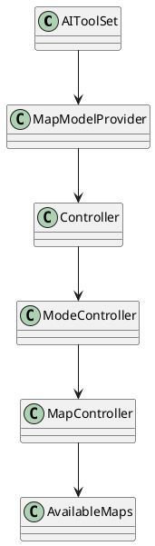
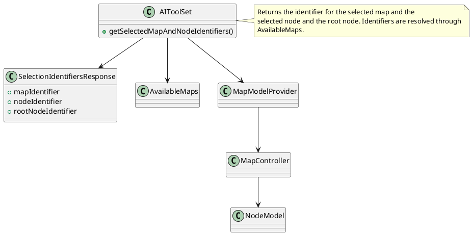
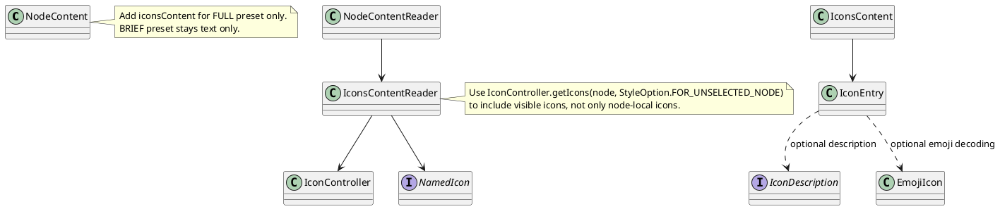

# Task: Add selection identifiers tool
- **Scope:** Add a tool that returns the currently selected map identifier, selected node identifier, and root node identifier.
- **Modified production files:**
  - freeplane_plugin_ai/src/main/java/org/freeplane/plugin/ai/tools/AIToolSet.java
  - freeplane_plugin_ai/src/main/java/org/freeplane/plugin/ai/tools/SelectedMapAndNodeIdentifiersTool.java
  - freeplane_plugin_ai/src/main/java/org/freeplane/plugin/ai/tools/SelectionIdentifiersResponse.java
- **Research summary:**

- **Design:**

- **Test specification:**
  - Verify the tool returns identifiers for the current map, selected node, and root node.
- **Design:**

- **Test specification:**
  - Verify icon entries include name and file for each icon.
  - Verify emoji icons include an emoji value when decoding is enabled.
  - Verify no icons content is returned for BRIEF preset.
