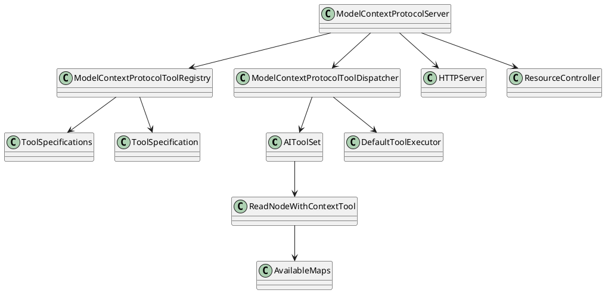
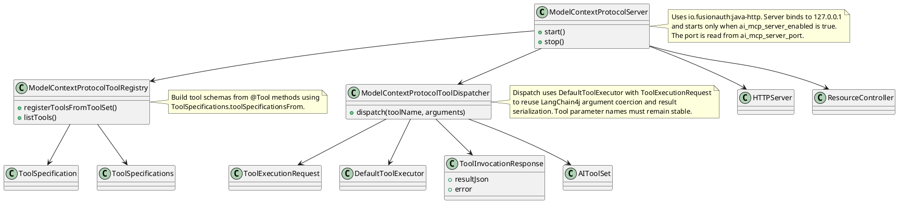

# Task: Model Context Protocol server
- **Scope:** Expose existing read tools through a Model Context Protocol server over an HTTP endpoint bound to the local interface, with startup controlled by preferences.
- **Modified production files:**
  - freeplane_plugin_ai/src/main/java/org/freeplane/plugin/ai/Activator.java
  - freeplane_plugin_ai/src/main/java/org/freeplane/plugin/ai/mcpserver/ModelContextProtocolServer.java
  - freeplane_plugin_ai/src/main/java/org/freeplane/plugin/ai/mcpserver/ModelContextProtocolTool.java
  - freeplane_plugin_ai/src/main/java/org/freeplane/plugin/ai/mcpserver/ModelContextProtocolToolDispatcher.java
  - freeplane_plugin_ai/src/main/java/org/freeplane/plugin/ai/mcpserver/ModelContextProtocolToolRegistry.java
  - freeplane_plugin_ai/src/main/resources/org/freeplane/plugin/ai/defaults.properties
  - freeplane_plugin_ai/src/main/resources/org/freeplane/plugin/ai/preferences.xml
- **Research summary:**

- **Design:**

- **Test specification:**
  - Verify tool registry returns schemas for read tools.
  - Verify dispatch routes a tool call to AIToolSet and returns JSON output.
  - Verify invalid tool name returns a protocol error response.
