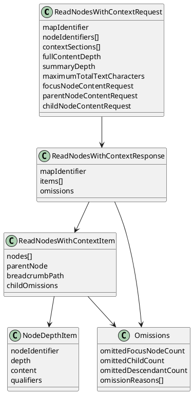

# Task: Extend readNodeWithContext content selection and optional qualifiers
- **Scope:** Redesign the read tool to accept list-only node identifiers and return list-only responses in the same order, add depth control for full content and summaries, enforce a total text budget by omitting nodes instead of truncating values, and make qualifiers optional.
- **Research summary:**
  - AI map exploration benefits from list-only requests to reduce round trips.
  - Total text budget control is more reliable than per node limits for tool safety.
  - Omitting nodes preserves full values while keeping responses within budget.
  - Separate depths for full content and brief summaries balance detail and coverage.
- **Design:**
  - List-only request and response ordered by nodeIdentifiers.
  - Depth controls: fullContentDepth plus additional summaryDepth.
  - NodeContentRequest overrides for focus, parent, and child nodes with presets as fallback.
  - Exact JavaScript Object Notation length budget with omissions instead of truncation.
  - Response-level omissions for omitted focus nodes, per-item childOmissions for omitted children and descendants.
  - Optional qualifiers enabled only via contextSections.
  - Tool schema marks optional fields explicitly and documents non-trivial defaults in field descriptions.
- **Design diagram:**

- **Request parameters:**
  - `mapIdentifier`: Map identifier string.
  - `nodeIdentifiers`: List of node identifier strings. Order is preserved in the response.
  - `contextSections`: List of ContextSection values. Default: empty list. Supported values: `BREADCRUMB_PATH`, `PARENT_SUMMARY`, `QUALIFIERS`.
  - `fullContentDepth`: Integer greater than or equal to 0. Default 0. Depth 0 is the requested node.
  - `summaryDepth`: Integer greater than or equal to 0. Default 1. This is the number of additional levels beyond fullContentDepth that return brief summaries. For example fullContentDepth 1 and summaryDepth 1 yields full content at depths 0–1 and brief summaries at depth 2.
  - `maximumTotalTextCharacters`: Integer. Default 65536.
  - `focusNodeContentRequest`: NodeContentRequest. Optional override for focus node full content.
  - `parentNodeContentRequest`: NodeContentRequest. Optional override for parent node summary content.
  - `childNodeContentRequest`: NodeContentRequest. Optional override for descendant full content.
- **Response fields:**
  - `mapIdentifier`: Map identifier string.
  - `items`: List of ReadNodesWithContextItem entries in the same order as nodeIdentifiers, excluding any omitted focus nodes.
  - `omissions`: Object, only when focus nodes are omitted.
- **ReadNodesWithContextItem:**
  - `nodes`: List of NodeDepthItem entries in preorder from depth 0 through depth fullContentDepth plus summaryDepth. Depth 0 is the requested node.
  - `parentNode`: NodeContentItem, only when `PARENT_SUMMARY` is present in contextSections.
  - `breadcrumbPath`: String, only when `BREADCRUMB_PATH` is present in contextSections.
  - `childOmissions`: Object, only when child or descendant omissions occur.
- **NodeDepthItem:**
  - `nodeIdentifier`: Node identifier string.
  - `depth`: Integer depth relative to the requested node.
  - `content`: NodeContent. Included for all nodes; summary nodes include briefText only.
  - `qualifiers`: List of strings, only when `QUALIFIERS` is present in contextSections.
- **Omissions:**
  - `omittedFocusNodeCount`: Integer (response-level omissions only).
  - `omittedChildCount`: Integer (childOmissions only).
  - `omittedDescendantCount`: Integer (childOmissions only).
  - `omissionReasons`: List of OmissionReason values.
- **Behavior:**
  - Summary depth always extends beyond fullContentDepth. Brief summaries cover depth fullContentDepth plus 1 through fullContentDepth plus summaryDepth.
  - Summary nodes always return briefText only. NodeContentRequest is ignored for summary nodes.
  - NodeContentRequest overrides are applied only to full content nodes. If a NodeContentRequest is not provided, presets are used: full for focus and child nodes, brief for parent node.
  - Qualifiers are computed and returned only when `QUALIFIERS` is present in contextSections.
  - Textual content values are returned as plain text using HtmlUtils.htmlToPlain, with markup removed when present.
  - The total text budget uses exact JavaScript Object Notation serialization length and is enforced only when more than one focus node is requested.
  - When the budget is exceeded, the tool omits nodes instead of truncating values. Omitted focus nodes are excluded from `items` and counted in response-level omissions with omissionReasons containing `TEXT_BUDGET`. Omitted child and descendant nodes are recorded in childOmissions.
  - Single focus node requests are never truncated, regardless of maximumTotalTextCharacters.
  - Duplicate node identifiers return an error with message "duplicate node identifiers".
  - Unknown node identifiers return an error with message "Unknown node identifiers: ..." and the list of unknown identifiers.
  - When nodeIdentifiers is empty or null, the tool uses the root node identifier as the only requested node.
- **Test specification:**
  - Verify response preserves requested node order.
  - Verify fullContentDepth and summaryDepth produce expected depth ranges.
  - Verify summary nodes include only briefText and ignore NodeContentRequest.
  - Verify qualifiers are omitted unless requested.
  - Verify total text budget omits nodes for multi node requests and never truncates single node requests.
  - Verify omissions include omissionReasons with `TEXT_BUDGET` when budget is exceeded.

## Shared structures for read and search tools
- **NodeContentRequest:**
  - `textualContentRequest`: TextualContentRequest. Optional; omit to skip textual content matching or inclusion.
  - `attributesContentRequest`: AttributesContentRequest. Optional; omit to skip attributes matching or inclusion.
  - `tagsContentRequest`: TagsContentRequest. Optional; omit to skip tags matching or inclusion.
- **TextualContentRequest:**
  - `includesText`: Boolean.
  - `includesDetails`: Boolean.
  - `includesNote`: Boolean.
- **AttributesContentRequest:**
  - `includesAttributes`: Boolean.
- **TagsContentRequest:**
  - `includesTags`: Boolean.
- **NodeContentItem:**
  - `nodeIdentifier`: Node identifier string.
  - `content`: NodeContent.
  - `qualifiers`: List of strings when qualifiers are requested.
- **NodeContent:**
  - `briefText`: String.
  - `textualContent`: TextualContent.
  - `attributesContent`: AttributesContent.
  - `tagsContent`: TagsContent.
- **OmissionReason:**
  - `TEXT_BUDGET`: Omitted because the maximumTotalTextCharacters budget was exceeded.
- **SearchMatchingMode:**
  - `CONTAINS`: Substring match (caseSensitivity controls casing).
  - `EQUALS`: Full value match (caseSensitivity controls casing).
  - `REGULAR_EXPRESSION`: Java regular expression match (caseSensitivity controls casing).
- **SearchCaseSensitivity:**
  - `CASE_INSENSITIVE`: Case-insensitive matching for all modes.
  - `CASE_SENSITIVE`: Case-sensitive matching for all modes.
