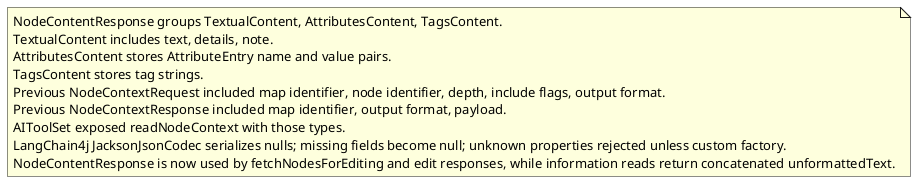
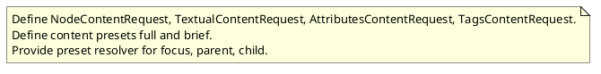

# Task: Read context request hierarchy and presets
- **Scope:** Define a new internal NodeContentRequest hierarchy with content presets for focus, parent, and child nodes.
- **Research summary:**

- **Design:**

- **Test specification:**
  - Not applicable for structure-only change.
