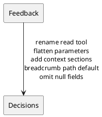
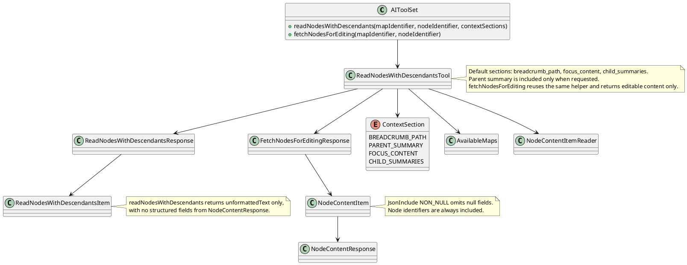

# Task: Review llm feedback for read tools
- **Scope:** Apply feedback to the read tool by renaming it to readNodesWithDescendants, flattening parameters, adding section selectors, returning concatenated unformatted text only, and omitting null fields in responses. Expose a fetchNodesForEditing tool that returns structured editable content for precise edits.
- **Modified production files:**
  - freeplane_plugin_ai/src/main/java/org/freeplane/plugin/ai/tools/AIToolSet.java
  - freeplane_plugin_ai/src/main/java/org/freeplane/plugin/ai/tools/ContextSection.java
  - freeplane_plugin_ai/src/main/java/org/freeplane/plugin/ai/tools/NodeContentResponse.java
  - freeplane_plugin_ai/src/main/java/org/freeplane/plugin/ai/tools/NodeContentItem.java
  - freeplane_plugin_ai/src/main/java/org/freeplane/plugin/ai/tools/NodeContentItemReader.java
  - freeplane_plugin_ai/src/main/java/org/freeplane/plugin/ai/tools/ReadNodesWithDescendantsResponse.java
  - freeplane_plugin_ai/src/main/java/org/freeplane/plugin/ai/tools/ReadNodesWithDescendantsTool.java
  - freeplane_plugin_ai/src/main/java/org/freeplane/plugin/ai/tools/TextualContent.java
  - freeplane_plugin_ai/src/main/java/org/freeplane/plugin/ai/tools/AttributesContent.java
  - freeplane_plugin_ai/src/main/java/org/freeplane/plugin/ai/tools/TagsContent.java
- **Modified test files:**
  - freeplane_plugin_ai/src/test/java/org/freeplane/plugin/ai/tools/ReadNodesWithDescendantsToolTest.java
- **Research summary:**

- **Design:**

- **Test specification:**
  - Verify default sections include focus content, child summaries, and breadcrumb path.
  - Verify parent summary is included when requested.
  - Verify focus content is omitted when not requested.
  - Verify invalid map identifiers fail fast.
  - Verify readNodesWithDescendants returns unformattedText only, with labeled sections for details, note, tags, attributes, and icons when present.
