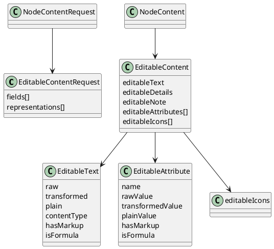

# Task: Add node content edit tool
- **Scope:** Add a tool to edit node content values for text, details, note, attributes, tags, and icons, and return identifiers and short texts for all modified nodes. Run only on specific user requests.
- **Motivation:** Editing must cover all editable content types and return updated identifiers and short texts so the model can continue edits without extra reads.
- **Research summary:**
  - Review how text, details, and note changes are applied through TextController and how formatted or formula content is handled.
  - Review how attribute, tag, and icon updates are applied and how explicit node icons are distinguished from style icons.
  - Review how short text is generated for use in tool responses.
- **Design:**
  - Accept a list of node updates with only the fields to change.
  - Align with editable content formats to avoid corrupting formulas or markup.
  - Support updates for attributes, tags, and explicit node icons (not style icons) alongside text, details, and note.
  - Require a user summary string in the request and return it in the response for display.
  - Enforce map consistency and return an error when an edit cannot be applied.
  - Return identifiers and short texts for all modified nodes as part of the response.
  - Formatting and style manipulation are out of scope for this tool.
**Test specification:**
  - Verify edits are applied to the correct nodes for each content type.
  - Verify invalid edits return an error without partial changes.
  - Verify responses include identifiers and short texts for all modified nodes.

## Subtasks

### Subtask: Add editable content for safe edits
- **Status:** Plan Review
- **Scope:** Add an optional editable content block that exposes raw values and format metadata for text, details, note, attributes, and explicit node icons so a large language model can edit safely without losing formulas or markup.
- **Motivation:** Editing with transformed output risks data loss for formulas, markup, or raw attribute values. Providing editable representations makes safe edits possible without changing how the map renders. This is needed before adding editing tools to avoid corrupting node content.
- **Research summary:**
  - TextController applies a transformer chain that can change display text, add formatting, or evaluate formulas.
  - RichTextModel stores content type and raw or Extensible Markup Language content separately from transformed output.
  - Attributes are transformed for display, but their raw values should be preserved for editing.
  - Explicit node icons are stored on the node (`NodeModel.getIcons()`), which excludes style icons. This is the icon set that should be editable.
- **Design:**
  - Add `EditableContentRequest` to `NodeContentRequest` to opt in to editable content.
  - `EditableContentRequest` selects fields (`TEXT`, `DETAILS`, `NOTE`, `ATTRIBUTES`) and representations (`RAW`, `TRANSFORMED`, `PLAIN`, `METADATA`).
  - `EditableContent` appears only when requested to reduce token usage.
  - Each editable field includes raw content, transformed content, plain text, and metadata for format and formula detection.
  - Add `editableIcons` to `EditableContent`, sourced only from `NodeModel.getIcons()` and described with the same English description rules used elsewhere (resources, emoji decoding, user icon relative path).
- **Design diagram:**

- **Test specification:**
  - Verify editable content is omitted when not requested.
  - Verify raw values match stored values for text, details, note, and attributes.
  - Verify transformed values match TextController output.
  - Verify plain values use `HtmlUtils.htmlToPlain` and do not include markup.
  - Verify formula detection sets `isFormula` for formula content and leaves it false for normal text.
  - Verify editable icons only include explicit node icons and exclude style icons.

### Subtask: Add editing tool confirmation and consent
- **Status:** Plan Review
- **Scope:** Add per tool confirmation dialogs and consent handling for editing tools, with separate confirmations for Model Context Protocol mode and large language model mode.
- **Motivation:** Editing operations need explicit user consent that is specific to each tool and to the interaction mode.
- **Research summary:**
  - Review how `OptionalDontShowMeAgainDialog` is used in other Freeplane features.
  - Review where Model Context Protocol mode and large language model mode are detected in the plugin.
- **Design:**
  - Use `OptionalDontShowMeAgainDialog` per tool, not as a global setting.
  - Store separate confirmation preferences for Model Context Protocol mode and large language model mode.
  - Use the user summary from tool responses as the primary confirmation text.
  - Ensure editing tools surface errors when confirmation is denied or unavailable.
  - Open question: should modifying tool requests also include user scope and user motivation strings for display?
- **Test specification:**
  - Verify each tool shows its own confirmation dialog and stores its own preference.
  - Verify Model Context Protocol mode and large language model mode have separate confirmation preferences.
  - Verify denied confirmation prevents the edit and returns an error.

### Subtask: Rename creation helpers to `setInitialContent`
- **Status:** Finished
- **Scope:** Rename `TextualContentEditor`, `AttributesContentEditor`, `TagsContentEditor`, and `IconsContentEditor` to expose `setInitialContent(NodeModel, ...)` so the creation path is explicitly labeled and a new edit path can later coexist. Update `NodeContentApplier` to call the new method so the helper names align with their current usage.
- **Motivation:** Making the creation helpers’ intent explicit prevents confusion with future editing helpers, as discussed in finished task 017’s editor design, and frees the `apply` name for actual edit methods that integrate undo/redo.
- **Research summary:**
  - Task 017 highlighted that the helpers currently serve only the creation path where undo is not available, so renaming them clarifies their role before we add undo-aware editors.
- **Design:**
  - Rename each editor method from `apply(...)` to `setInitialContent(...)`, leaving the internal logic unchanged.
  - Update `NodeContentApplier.guardApply` to call the renamed methods, keeping the creation flow intact while preparing for future edit helpers.
  - **Test specification:**
  - Rely on existing creation path tests (e.g., `NodeContentApplierTest`) to ensure the rename doesn’t break behavior; no additional test cases are required for the refactor.
  - **Modified files:**
  - `freeplane_plugin_ai/src/main/java/org/freeplane/plugin/ai/tools/NodeContentApplier.java`
  - `freeplane_plugin_ai/src/main/java/org/freeplane/plugin/ai/tools/TextualContentEditor.java`
  - `freeplane_plugin_ai/src/main/java/org/freeplane/plugin/ai/tools/AttributesContentEditor.java`
  - `freeplane_plugin_ai/src/main/java/org/freeplane/plugin/ai/tools/TagsContentEditor.java`
  - `freeplane_plugin_ai/src/main/java/org/freeplane/plugin/ai/tools/IconsContentEditor.java`

### Subtask: Define edit request/response structure
- **Status:** Plan Review
- **Scope:** Define the enums and DTOs that describe which node element is being edited, its `ContentType`, the value the model edits, and the structure returned by the edit tool so multiple elements per node can be updated in one request while still returning per-element metadata.
- **Motivation:** The edit tool needs to know which element was read (text, details, note, attributes, tags, icons) and what `ContentType` the model saw (plain text, HTML, Markdown, LaTeX, formula) so it can reject mismatches and keep formula editing out of scope. Returning the edited element, content type, and new value gives the caller confirmation that the change was applied.
- **Research summary:**
  - The tool must already know if a field contains markup or a formula from the editable content metadata; exposing `ContentType` makes it explicit what the LLM expects before every edit.
  - Freeplane’s formula detection is built into the node editors, so we should reject edits when `isFormula` is true before or after the update to avoid corrupting formulas.
- **Design:**
  - Introduce an `EditedElement` enum with values such as `TEXT`, `DETAILS`, `NOTE`, `ATTRIBUTES`, `TAGS`, and `ICONS` so the tool request names the specific node field being edited.
  - Introduce a `ContentType` enum that distinguishes plain text, HTML, Markdown, LaTeX, and formula so the tool can validate that the model hasn’t switched formats.
  - The `NodeContentEditRequest` includes `mapIdentifier`, `nodeIdentifier`, `userSummary`, and a list of `NodeContentEditItem` entries. Each entry carries the `EditedElement`, the `ContentType` the model edited, and the new raw value to write.
  - The response returns the edited `NodeContentItem`, including the identifier, edited content, and brief text, so the caller can verify the current node state.
  - When editing collection-like elements (tags, icons, attributes), include the optional `index` from the editable content so duplicates can be targeted; the helper can also fall back to matching by value when the index is absent.
  - The edit helper must compare the node’s current `ContentType`/`isFormula` metadata against the request and reject the edit if the node currently contains a formula or if applying the new value would make it appear to be a formula (`isFormula` would become true).
- **Test specification:**
  - Not yet implemented; future tests should cover request validation, formula rejection, and the response shape.

### Subtask: Implement undo-aware edit helpers for textual content
- **Status:** Implementing
- **Scope:** Build edit helpers that rely on `MTextController` and `MNoteController` so node text, details, and notes are updated through the existing undo `IActor`s and content-type metadata.
- **Motivation:** Those editors already wrap writes in `IActor`s, fire `nodeChanged`, and expose `TextController.isFormula`, so reusing them keeps formulas guarded and the undo stack consistent.
- **Research summary:**
  - `MTextController.setNodeObject` sets the node user object inside an `IActor` and synchronizes with the map controller; `TextController.isFormula` inspects transformers and the special `'` prefix, so the edit helper should reject edits when formulas are involved (`freeplane/src/main/java/org/freeplane/features/text/mindmapmode/MTextController.java:556-593`, `freeplane/src/main/java/org/freeplane/features/text/TextController.java:183-192`).
  - `MTextController.setDetails`/`setDetailsContentType` clone the `DetailModel`, change text/content type, and swap the extension inside an `IActor`, which is exactly what we need for detail editing (`freeplane/src/main/java/org/freeplane/features/text/mindmapmode/MTextController.java:664-718`).
  - `MNoteController.setNoteText`/`setNoteContentType` follow the same copy-and-replace pattern for the `NoteModel` and fire the necessary `nodeChanged` events through undo actors (`freeplane/src/main/java/org/freeplane/features/note/mindmapmode/MNoteController.java:202-263`).
- **Test specification:**
  - Confirm the helper uses the controllers’ actors, respects the `isFormula` guard, and results in updated `NodeContentItem` content for text/details/note edits.

### Subtask: Implement undo-aware edit helpers for collections
- **Status:** Implementing
- **Scope:** Use `MAttributeController` and `MIconController` to implement add/delete/replace flows for attributes, tags, and explicit icons, honoring the optional `index`/selector and keeping all changes undoable.
- **Motivation:** Collection edits already execute inside `IActor`s (`SetAttributeValueActor`, `RemoveAttributeActor`, `addIcon`/`removeIcon`, etc.), so reusing them keeps the map consistent while allowing precise targeting of duplicates.
- **Research summary:**
  - `MAttributeController` provides actors for updating, inserting, and removing attribute entries and always executes them via `Controller.getCurrentModeController().execute`, so collection edits stay undoable and emit table change events (`freeplane/src/main/java/org/freeplane/features/attribute/mindmapmode/MAttributeController.java:297-484`).
  - `MIconController.setTagReferences` packages tag updates through an `IActor` that runs `Tags.setTagReferences` and fires `nodeChanged`, so we can reuse it for both tags and coloring operations (`freeplane/src/main/java/org/freeplane/features/icon/mindmapmode/MIconController.java:621-667`).
  - `MIconController.addIcon`/`removeIcon` also wrap their updates in `IActor`s, calling `node.addIcon`/`node.removeIcon` and notifying the map controller for explicit icon edits (`freeplane/src/main/java/org/freeplane/features/icon/mindmapmode/MIconController.java:302-349`, `529-562`).
  - The helper will honor the optional `index` and operation (add/delete/replace) so duplicates can be modified deterministically.
- **Test specification:**
  - Verify collection edits trigger the correct controller actors, the index/selector resolves the intended entry, and the returned `NodeContentItem` reflects the new attributes/tags/icons.
