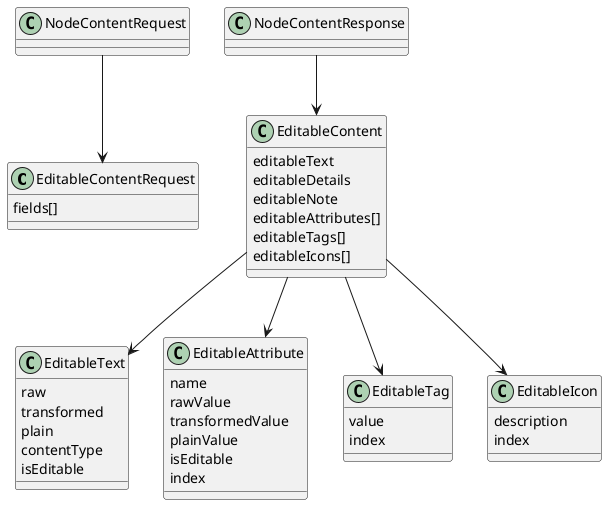

# Task: Add node content edit tool
- **Scope:** Add a tool to edit node content values for text, details, note, attributes, tags, and icons, and return identifiers and short texts for all modified nodes. Run only on specific user requests.
- **Motivation:** Editing must cover all editable content types and return updated identifiers and short texts so the model can continue edits without extra reads.
- **Research:**
  - Review how text, details, and note changes are applied through TextController and how formatted or formula content is handled.
  - Review how attribute, tag, and icon updates are applied and how explicit node icons are distinguished from style icons.
  - Review how short text is generated for use in tool responses.
- **Design:**
  - Accept a list of node updates with only the fields to change.
  - Align with editable content formats to avoid corrupting formulas or markup.
  - Support updates for attributes, tags, and explicit node icons (not style icons) alongside text, details, and note.
  - Require a user summary string in the request and return it in the response for display.
  - Enforce map consistency and return an error when an edit cannot be applied.
  - Return identifiers and short texts for all modified nodes as part of the response.
  - Formatting and style manipulation are out of scope for this tool.
**Test specification:**
  - Verify edits are applied to the correct nodes for each content type.
  - Verify invalid edits return an error without partial changes.
  - Verify responses include identifiers and short texts for all modified nodes.

## Subtasks

### Subtask: Add editable content for safe edits
- **Status:** Plan Review
- **Scope:** Add an optional editable content block that exposes raw values and format metadata for text, details, note, attributes, and explicit node icons so a large language model can edit safely without losing formulas or markup.
- **Motivation:** Editing with transformed output risks data loss for formulas, markup, or raw attribute values. Providing editable representations makes safe edits possible without changing how the map renders. This is needed before adding editing tools to avoid corrupting node content.
- **Research:**
  - TextController applies a transformer chain that can change display text, add formatting, or evaluate formulas.
  - RichTextModel stores content type and raw or Extensible Markup Language content separately from transformed output.
  - Attributes are transformed for display, but their raw values should be preserved for editing.
  - Explicit node icons are stored on the node (`NodeModel.getIcons()`), which excludes style icons. This is the icon set that should be editable.
- **Design:**
  - Add `EditableContentRequest` to `NodeContentRequest` to opt in to editable content.
  - `EditableContentRequest` selects fields (`TEXT`, `DETAILS`, `NOTE`, `ATTRIBUTES`, `TAGS`, `ICONS`). All representations are returned for selected fields.
  - `EditableContent` appears only when requested to reduce token usage.
  - Each editable field includes raw content, transformed content, plain text, and metadata for format and formula detection.
  - Add `editableTags` and `editableIcons` to `EditableContent`, sourced from `Tags.getTagReferences(node)` and `NodeModel.getIcons()`. Use the same English description rules used elsewhere for icon descriptions (resources, emoji decoding, user icon relative path).
  - Each editable collection item includes an `index` so duplicates can be targeted in later edit requests.
- **Design diagram:**

- **Test specification:**
  - Verify editable content is omitted when not requested.
  - Verify raw values match stored values for text, details, note, and attributes.
  - Verify transformed values match TextController output.
  - Verify plain values use `HtmlUtils.htmlToPlain` and do not include markup.
  - Verify formula detection sets `isEditable` false for formula content and true for normal text.
  - Verify editable icons only include explicit node icons and exclude style icons.

### Subtask: Add editing tool confirmation and consent
- **Status:** Plan Review
- **Scope:** Add per tool confirmation dialogs and consent handling for editing tools, with separate confirmations for Model Context Protocol mode and large language model mode.
- **Motivation:** Editing operations need explicit user consent that is specific to each tool and to the interaction mode.
- **Research:**
  - Review how `OptionalDontShowMeAgainDialog` is used in other Freeplane features.
  - Review where Model Context Protocol mode and large language model mode are detected in the plugin.
- **Design:**
  - Use `OptionalDontShowMeAgainDialog` per tool, not as a global setting.
  - Store separate confirmation preferences for Model Context Protocol mode and large language model mode.
  - Use the user summary from tool responses as the primary confirmation text.
  - Ensure editing tools surface errors when confirmation is denied or unavailable.
  - Open question: should modifying tool requests also include user scope and user motivation strings for display?
- **Test specification:**
  - Verify each tool shows its own confirmation dialog and stores its own preference.
  - Verify Model Context Protocol mode and large language model mode have separate confirmation preferences.
  - Verify denied confirmation prevents the edit and returns an error.

### Subtask: Rename creation helpers to `setInitialContent`
- **Status:** Finished
- **Scope:** Rename `TextualContentEditor`, `AttributesContentEditor`, `TagsContentEditor`, and `IconsContentEditor` to expose `setInitialContent(NodeModel, ...)` so the creation path is explicitly labeled and a new edit path can later coexist. Update `NodeContentApplier` to call the new method so the helper names align with their current usage.
- **Motivation:** Making the creation helpers’ intent explicit prevents confusion with future editing helpers, as discussed in finished task 017’s editor design, and frees the `apply` name for actual edit methods that integrate undo/redo.
- **Research:**
  - Task 017 highlighted that the helpers currently serve only the creation path where undo is not available, so renaming them clarifies their role before we add undo-aware editors.
- **Design:**
  - Rename each editor method from `apply(...)` to `setInitialContent(...)`, leaving the internal logic unchanged.
  - Update `NodeContentApplier.guardApply` to call the renamed methods, keeping the creation flow intact while preparing for future edit helpers.
  - **Test specification:**
  - Rely on existing creation path tests (e.g., `NodeContentApplierTest`) to ensure the rename doesn’t break behavior; no additional test cases are required for the refactor.
  - **Modified files:**
  - `freeplane_plugin_ai/src/main/java/org/freeplane/plugin/ai/tools/NodeContentApplier.java`
  - `freeplane_plugin_ai/src/main/java/org/freeplane/plugin/ai/tools/TextualContentEditor.java`
  - `freeplane_plugin_ai/src/main/java/org/freeplane/plugin/ai/tools/AttributesContentEditor.java`
  - `freeplane_plugin_ai/src/main/java/org/freeplane/plugin/ai/tools/TagsContentEditor.java`
  - `freeplane_plugin_ai/src/main/java/org/freeplane/plugin/ai/tools/IconsContentEditor.java`

### Subtask: Define edit request/response structure
- **Status:** Plan Review
- **Scope:** Define the enums and data transfer objects that describe which node element is being edited, its `ContentType`, the value the model edits, and the structure returned by the edit tool so multiple elements per node can be updated in one request while still returning the updated node content.
- **Motivation:** The edit tool needs to know which element was read (text, details, note, attributes, tags, icons) and what `ContentType` the model saw (plain text, HTML, Markdown, LaTeX, formula) so it can reject mismatches and keep formula editing out of scope. Returning the updated node content gives the caller confirmation that the change was applied.
- **Research:**
  - The tool must already know if a field contains markup or a formula from the editable content metadata; exposing `ContentType` makes it explicit what the LLM expects before every edit.
  - Freeplane’s formula detection is built into the node editors, so we should reject edits when `isEditable` is false before or after the update to avoid corrupting formulas.
- **Design:**
  - Introduce an `EditedElement` enum with values such as `TEXT`, `DETAILS`, `NOTE`, `ATTRIBUTES`, `TAGS`, and `ICONS` so the tool request names the specific node field being edited.
  - Introduce a `ContentType` enum that distinguishes plain text, HTML, Markdown, LaTeX, and formula so the tool can validate that the model hasn’t switched formats.
- The `EditRequest` includes `mapIdentifier`, `userSummary`, and a list of `NodeContentEditItem` entries. Each entry carries the `nodeIdentifier`, the `EditedElement`, the original `ContentType` the model edited, and the new raw value to write.
- The response returns a list of edited `NodeContentItem` entries so the caller can verify the updated state per node without repeating the request items.
  - Require fetchNodesForEditing before edits so original content type and editability metadata come from editable content, not readNodesWithDescendants output.
  - When editing collection-like elements (tags, icons, attributes), include the optional `index` from the editable content so duplicates can be targeted; the helper can also fall back to matching by value when the index is absent.
  - The edit helper must compare the node’s current `ContentType` and editability metadata against the request and reject the edit if the node is not editable or if applying the new value would make it appear to be a formula.
  - For text edits, determine the current content type from a `\\latex` or `\\unparsedlatex` prefix first, then from node format when it is markdown or latex, otherwise use HTML detection on the raw text.
  - For plain text or html node text, allow the new value to be either plain text or html without conversion.
  - For latex node text, strip any `\\latex` or `\\unparsedlatex` prefix from the edit value and reapply the original prefix; for details and note latex content types, strip any prefix but do not reapply.
  - Reject `ContentType` values that indicate a formula for any edit, and reject html content for markdown or latex edits.
- **Test specification:**
  - Not yet implemented; future tests should cover request validation, formula rejection, and the response shape.

### Subtask: Implement undo-aware edit helpers for textual content
- **Status:** Implementing
- **Scope:** Build edit helpers that rely on `MTextController` and `MNoteController` so node text, details, and notes are updated through the existing undo `IActor`s and content-type metadata.
- **Motivation:** Those editors already wrap writes in `IActor`s, fire `nodeChanged`, and expose `TextController.isFormula`, so reusing them keeps formulas guarded and the undo stack consistent; the `isEditable` metadata is derived from the same formula checks.
- **Research:**
  - `MTextController.setNodeObject` sets the node user object inside an `IActor` and synchronizes with the map controller; `TextController.isFormula` inspects transformers and the special `'` prefix, so the edit helper should reject edits when formulas are involved and mark `isEditable` false (`freeplane/src/main/java/org/freeplane/features/text/mindmapmode/MTextController.java:556-593`, `freeplane/src/main/java/org/freeplane/features/text/TextController.java:183-192`).
  - `MTextController.setDetails`/`setDetailsContentType` clone the `DetailModel`, change text/content type, and swap the extension inside an `IActor`, which is exactly what we need for detail editing (`freeplane/src/main/java/org/freeplane/features/text/mindmapmode/MTextController.java:664-718`).
  - `MNoteController.setNoteText`/`setNoteContentType` follow the same copy-and-replace pattern for the `NoteModel` and fire the necessary `nodeChanged` events through undo actors (`freeplane/src/main/java/org/freeplane/features/note/mindmapmode/MNoteController.java:202-263`).
- **Test specification:**
  - Confirm the helper uses the controllers’ actors, respects the `isEditable` guard, and results in updated `NodeContentItem` content for text/details/note edits.

### Subtask: Implement undo-aware edit helpers for collections
- **Status:** Implementing
- **Scope:** Use `MAttributeController` and `MIconController` to implement add/delete/replace flows for attributes, tags, and explicit icons, honoring the optional `index`/selector and keeping all changes undoable.
- **Motivation:** Collection edits already execute inside `IActor`s (`SetAttributeValueActor`, `RemoveAttributeActor`, `addIcon`/`removeIcon`, etc.), so reusing them keeps the map consistent while allowing precise targeting of duplicates.
- **Research:**
  - `MAttributeController` provides actors for updating, inserting, and removing attribute entries and always executes them via `Controller.getCurrentModeController().execute`, so collection edits stay undoable and emit table change events (`freeplane/src/main/java/org/freeplane/features/attribute/mindmapmode/MAttributeController.java:297-484`).
  - `MIconController.setTagReferences` packages tag updates through an `IActor` that runs `Tags.setTagReferences` and fires `nodeChanged`, so we can reuse it for both tags and coloring operations (`freeplane/src/main/java/org/freeplane/features/icon/mindmapmode/MIconController.java:621-667`).
  - `MIconController.addIcon`/`removeIcon` also wrap their updates in `IActor`s, calling `node.addIcon`/`node.removeIcon` and notifying the map controller for explicit icon edits (`freeplane/src/main/java/org/freeplane/features/icon/mindmapmode/MIconController.java:302-349`, `529-562`).
  - The helper will honor the optional `index` and operation (add/delete/replace) so duplicates can be modified deterministically.
- **Test specification:**
  - Verify collection edits trigger the correct controller actors, the index/selector resolves the intended entry, and the returned `NodeContentItem` reflects the new attributes/tags/icons.

### Subtask: Prune MCP schema via input-only DTOs
- **Status:** Plan Review
- **Scope:** Introduce input-only data transfer objects for write tools (`createNodes`, `createSummary`, `edit`) using a minimal base class, and move output-only fields (like `editableContent`, transformed values, and metadata) into derived response types so the MCP schema is smaller.
- **Motivation:** Tool schemas are too large (around 10,000 tokens). Input schemas should include only writable fields to reduce token usage while keeping rich output responses.
- **Design decisions:**
  - Use a base input class with only writable fields (text/details/note, attributes, tags, icons).
  - Output classes extend the base and add read-only fields.
  - Keep tool descriptions short and rely on the minimal formatting guidance already added.
- **Test specification:**
  - Existing tests should still pass; add targeted tests only if schema generation or request parsing changes.

### Subtask: Allow plain text to HTML conversion for node core
- **Status:** Plan Review
- **Scope:** Permit edits that convert node core text between plain text and HTML without rejecting the change.
- **Motivation:** Core text already supports HTML formatting; blocking conversions causes unnecessary edit failures and forces the model to guess.
- **Design:**
  - Treat plain text and HTML as compatible for node core text edits.
  - Do not reject edits that switch between plain text and HTML for node core text.
  - Keep existing content type checks for details, notes, markdown, and latex.
- **Test specification:**
  - Add tests that allow a plain text node core to accept HTML-wrapped edits and that still reject markdown or latex mismatches.

### Subtask: Allow content type selection for new nodes
- **Status:** Implementation Review
- **Scope:** Allow node creation to specify content types so new nodes can be created as Markdown or LaTeX when appropriate.
- **Motivation:** The model should be able to generate Markdown and LaTeX content at creation time without post-edit conversions.
- **Research:**
  - Node core text content type is derived from node format and optional LaTeX prefixes, not a stored explicit type; details and notes store content type separately.
  - `NodeStyleModel.setNodeFormat` can set node format directly when creating content, which avoids undo and works before the node is attached.
  - Details and notes store content type on the `DetailModel` and `NoteModel` via `setContentType`, so initial content can set both text and content type.
- **Design:**
  - Extend the create nodes request content to include optional content type fields for text, details, and note.
  - For node core text, allow `PLAIN_TEXT`, `HTML`, `MARKDOWN`, and `LATEX`; treat `LATEX` as a content prefix if needed.
  - For details and note, allow `PLAIN_TEXT`, `HTML`, `MARKDOWN`, and `LATEX` and set the underlying content type accordingly.
  - Set node format directly for markdown or latex content types without using undo-aware controllers.
  - Only set content type fields when the user explicitly requests Markdown or LaTeX (or formatting that requires it); otherwise omit them so defaults stay plain text.
  - Default behavior remains unchanged when content type is omitted.
- **Test specification:**
  - Add tests that create nodes with Markdown and LaTeX content types and verify stored formats for text, details, and note.

### Subtask: Provide icon catalog guidance for edits
- **Status:** Plan Review
- **Scope:** Ensure the model can discover valid icon names without enumerating every icon in tool descriptions.
- **Motivation:** Icon names are long and the model hallucinates when it cannot access the catalog; we need a scalable way to surface valid icon names.
- **Research:**
  - `IconStoreFactory.ICON_STORE` holds the built-in and user icon catalog; `IconStore.getMindIcons()` returns all mind icons, including user icons, while `IconStore.getUserIcons()` returns user icons explicitly (`freeplane/src/main/java/org/freeplane/features/icon/IconStore.java`, `freeplane/src/main/java/org/freeplane/features/icon/factory/IconStoreFactory.java`).
  - Emoji icons are loaded into a separate emoji group (`IconStore.EMOJI_GROUP`) via `IconStoreFactory.createEmojiIcons()` from the generated `emojientries.xml` catalog (`freeplane/src/main/java/org/freeplane/features/icon/factory/IconStoreFactory.java`).
  - `IconDescriptionResolver.resolveDescription` yields the values accepted by edits (emoji character, user icon file, or translated description), so a catalog tool should reuse this resolver for consistency (`freeplane_plugin_ai/src/main/java/org/freeplane/plugin/ai/tools/IconDescriptionResolver.java`).
- **Design:**
  - Add a `listAvailableIcons` tool that returns the catalog of built-in and user icons.
  - The response should explicitly note: "This list includes built-in and user-defined Freeplane icons only; emoji icons are referenced by the emoji character itself and are not listed here."
  - Avoid embedding the full catalog in other tool schemas to keep token usage low.
- **Test specification:**
  - Add tests that validate the icon catalog response and that edit errors still report unknown icon descriptions.
