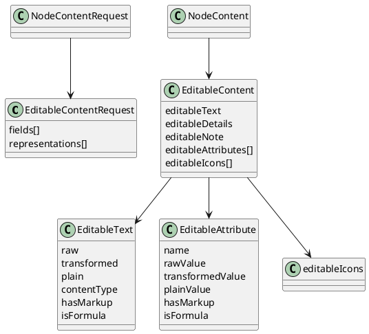

# Task: Add node content edit tool
- **Scope:** Add a tool to edit node content values for text, details, note, attributes, tags, and icons, and return identifiers and short texts for all modified nodes. Run only on specific user requests.
- **Motivation:** Editing must cover all editable content types and return updated identifiers and short texts so the model can continue edits without extra reads.
- **Research summary:**
  - Review how text, details, and note changes are applied through TextController and how formatted or formula content is handled.
  - Review how attribute, tag, and icon updates are applied and how explicit node icons are distinguished from style icons.
  - Review how short text is generated for use in tool responses.
- **Design:**
  - Accept a list of node updates with only the fields to change.
  - Align with editable content formats to avoid corrupting formulas or markup.
  - Support updates for attributes, tags, and explicit node icons (not style icons) alongside text, details, and note.
  - Require a user summary string in the request and return it in the response for display.
  - Enforce map consistency and return an error when an edit cannot be applied.
  - Return identifiers and short texts for all modified nodes as part of the response.
  - Formatting and style manipulation are out of scope for this tool.
**Test specification:**
  - Verify edits are applied to the correct nodes for each content type.
  - Verify invalid edits return an error without partial changes.
  - Verify responses include identifiers and short texts for all modified nodes.

## Subtasks

### Subtask: Add editable content for safe edits
- **Status:** Planning
- **Scope:** Add an optional editable content block that exposes raw values and format metadata for text, details, note, attributes, and explicit node icons so a large language model can edit safely without losing formulas or markup.
- **Motivation:** Editing with transformed output risks data loss for formulas, markup, or raw attribute values. Providing editable representations makes safe edits possible without changing how the map renders. This is needed before adding editing tools to avoid corrupting node content.
- **Research summary:**
  - TextController applies a transformer chain that can change display text, add formatting, or evaluate formulas.
  - RichTextModel stores content type and raw or Extensible Markup Language content separately from transformed output.
  - Attributes are transformed for display, but their raw values should be preserved for editing.
  - Explicit node icons are stored on the node (`NodeModel.getIcons()`), which excludes style icons. This is the icon set that should be editable.
- **Design:**
  - Add `EditableContentRequest` to `NodeContentRequest` to opt in to editable content.
  - `EditableContentRequest` selects fields (`TEXT`, `DETAILS`, `NOTE`, `ATTRIBUTES`) and representations (`RAW`, `TRANSFORMED`, `PLAIN`, `METADATA`).
  - `EditableContent` appears only when requested to reduce token usage.
  - Each editable field includes raw content, transformed content, plain text, and metadata for format and formula detection.
  - Add `editableIcons` to `EditableContent`, sourced only from `NodeModel.getIcons()` and described with the same English description rules used elsewhere (resources, emoji decoding, user icon relative path).
- **Design diagram:**

- **Test specification:**
  - Verify editable content is omitted when not requested.
  - Verify raw values match stored values for text, details, note, and attributes.
  - Verify transformed values match TextController output.
  - Verify plain values use `HtmlUtils.htmlToPlain` and do not include markup.
  - Verify formula detection sets `isFormula` for formula content and leaves it false for normal text.
  - Verify editable icons only include explicit node icons and exclude style icons.

### Subtask: Add editing tool confirmation and consent
- **Status:** Planning
- **Scope:** Add per tool confirmation dialogs and consent handling for editing tools, with separate confirmations for Model Context Protocol mode and large language model mode.
- **Motivation:** Editing operations need explicit user consent that is specific to each tool and to the interaction mode.
- **Research summary:**
  - Review how `OptionalDontShowMeAgainDialog` is used in other Freeplane features.
  - Review where Model Context Protocol mode and large language model mode are detected in the plugin.
- **Design:**
  - Use `OptionalDontShowMeAgainDialog` per tool, not as a global setting.
  - Store separate confirmation preferences for Model Context Protocol mode and large language model mode.
  - Use the user summary from tool responses as the primary confirmation text.
  - Ensure editing tools surface errors when confirmation is denied or unavailable.
  - Open question: should modifying tool requests also include user scope and user motivation strings for display?
- **Test specification:**
  - Verify each tool shows its own confirmation dialog and stores its own preference.
  - Verify Model Context Protocol mode and large language model mode have separate confirmation preferences.
  - Verify denied confirmation prevents the edit and returns an error.
